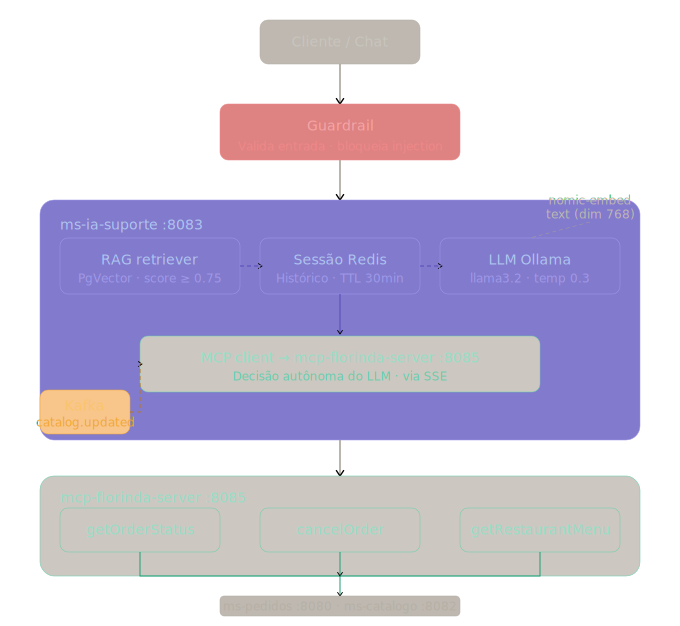

# Agente Florinda IA — Fase 3

Documentação completa do subsistema de Inteligência Artificial conversacional do **Florinda Eats**, composto por dois módulos:

| Módulo | Porta | Responsabilidade |
|---|---|---|
| `ms-ia-suporte` | **8083** | Agente RAG + LLM (LangChain4j + Ollama) |
| `mcp-florinda-server` | **8085** | Ferramentas MCP via SSE (status pedido, cancelamento, cardápio) |

---

## Arquitetura



O diagrama acima mostra o fluxo completo:

```
Cliente HTTP
    │
    ▼ POST /v1/ia/chat
ms-ia-suporte (8083)
    ├─ InputGuardrail      → valida entrada (anti-injection)
    ├─ SessaoMemoriaService → histórico no Redis
    ├─ RagIngestaoService  → busca semântica no PgVector
    ├─ FlorindaAiService   → interface @RegisterAiService (LangChain4j)
    │       └─ LLM Ollama (llama3.2) ←─── resposta gerada
    └─ MCP Tool calls ──► mcp-florinda-server (8085)
                              ├─ getOrderStatus    → ms-pedidos (8080)
                              ├─ cancelOrder       → ms-pedidos (8080)
                              └─ getRestaurantMenu → ms-catalogo (8082)
```

**Fluxo de reindexação automática via Kafka:**
```
ms-catalogo ──► catalog.item.updated ──► CatalogKafkaConsumer ──► PgVector
ms-pedidos  ──► order.status.updated ──► consumer (ms-ia-suporte)
```

---

## Stack da Fase 3

| Componente | Tecnologia | Versão |
|---|---|---|
| LLM | Ollama / llama3.2 | latest |
| Embeddings | Ollama / nomic-embed-text | latest |
| Vector Store | PgVector (PostgreSQL extension) | pg16 |
| Framework IA | LangChain4j | 0.26.1 |
| MCP Protocol | Quarkiverse MCP Server | 1.0.0.CR1 |
| Memória de sessão | Redis | 7 |
| Banco de conhecimento | PostgreSQL (ia_suporte_db) | 16 |

---

## Pré-requisitos

Além dos pré-requisitos da Fase 2 (Docker, JDK 21, Maven 3.9+):

- **Ollama instalado localmente** (recomendado) **ou** via Docker
  - Download: https://ollama.com/download
  - Após instalar, o serviço sobe automaticamente em `http://localhost:11434`
- Modelos necessários (baixe uma vez): `llama3.2` (~2 GB) e `nomic-embed-text` (~300 MB)
- Fase 2 funcional: containers `florinda-postgres`, `florinda-redis`, `florinda-kafka` ativos

> **Ollama nativo x Docker:** se o Ollama estiver instalado na máquina, o `dev-up.ps1` detecta automaticamente na porta 11434 e **não cria nenhum container Docker** para ele. Os modelos ficam no diretório local do Ollama (`~/.ollama/models`).

### Verificar Ollama e modelos instalados

```powershell
# Confirmar que o Ollama está respondendo
Invoke-RestMethod http://localhost:11434/api/tags

# Listar modelos disponíveis
ollama list
```

Resultado esperado:
```
NAME                       SIZE
llama3.2:latest            1.9 GB
nomic-embed-text:latest    0.3 GB
```

Se algum modelo estiver faltando:
```powershell
ollama pull llama3.2
ollama pull nomic-embed-text
```

---

## Passo a passo para subir a Fase 3

### Opção A — Script automático (recomendado)

```powershell
# Na raiz do projeto, com Docker ativo:
Set-Location "C:\Users\marcu\workspace\Projeto\florinda-eats"

# 1. Garantir toda a infra (inclui Ollama) + abrir terminais dos 6 módulos
.\dev-up.ps1 -StartModules -KillPorts

# 2. Aguardar health + ver quais estão online
.\dev-up.ps1 -StartModules -KillPorts -WaitForHealth

# 3. (Apenas uma vez) baixar modelos LLM no Ollama
.\dev-up.ps1 -PullModels
```

> O flag `-PullModels` pode ser combinado com qualquer outro: `.\dev-up.ps1 -StartModules -KillPorts -PullModels`

---

### Opção B — Passo a passo manual

#### Passo 1 — Ajustar Java e Maven no terminal

```powershell
$env:JAVA_HOME = "C:\Program Files\Eclipse Adoptium\jdk-21.0.10.7-hotspot"
$env:Path = "$env:JAVA_HOME\bin;" + (($env:Path -split ';' | Where-Object { $_ -and ($_ -notmatch 'Oracle\\Java\\javapath') -and ($_ -notmatch 'Java\\jdk-25') } | Select-Object -Unique) -join ';')
if (-not (Get-Command mvn -ErrorAction SilentlyContinue)) {
  $env:Path += ";C:\Users\marcu\tools\apache-maven-3.9.9\bin"
}
java -version ; mvn -v
```

#### Passo 2 — Subir infraestrutura base (Fase 2)

```powershell
# PostgreSQL com extensão PgVector (catalogo_db + ia_suporte_db)
docker start florinda-postgres
# Se for primeira vez:
docker run --name florinda-postgres -e POSTGRES_DB=catalogo_db -e POSTGRES_USER=florinda -e POSTGRES_PASSWORD=florinda123 -p 5433:5432 -d pgvector/pgvector:pg16

# Criar o banco ia_suporte_db (uma vez)
docker exec florinda-postgres psql -U florinda -d postgres -c "CREATE DATABASE ia_suporte_db" 2>$null

docker start florinda-redis
docker start florinda-mysql-pedidos
docker start florinda-mysql-pagamentos
docker start florinda-kafka
```

#### Passo 3 — Ollama (nativo ou Docker)

**Opção A — Ollama instalado nativamente (recomendado)**

Se o Ollama já está instalado (https://ollama.com/download), ele sobe automaticamente como serviço do Windows. Verifique:

```powershell
Invoke-RestMethod http://localhost:11434/api/tags
# deve listar os modelos instalados

ollama list
# llama3.2:latest e nomic-embed-text:latest devem aparecer
```

Se precisar baixar os modelos:
```powershell
ollama pull llama3.2
ollama pull nomic-embed-text
```

**Opção B — Ollama via Docker** (somente se não tiver instalação nativa)

```powershell
docker run --name florinda-ollama -p 11434:11434 -v florinda-ollama-data:/root/.ollama -d ollama/ollama

# Aguardar e baixar modelos (apenas uma vez)
Start-Sleep -Seconds 8
docker exec florinda-ollama ollama pull llama3.2
docker exec florinda-ollama ollama pull nomic-embed-text
```

> O `dev-up.ps1` detecta automaticamente qual cenário se aplica — não é necessário configurar nada manualmente.

#### Passo 4 — Verificar containers ativos

```powershell
docker ps --format "table {{.Names}}`t{{.Status}}`t{{.Ports}}"
```

Resultado esperado (sem Ollama nativo já rodando):

```
NAMES                       STATUS          PORTS
florinda-kafka              Up              0.0.0.0:9092->9092/tcp
florinda-mysql-pagamentos   Up              0.0.0.0:3308->3306/tcp
florinda-mysql-pedidos      Up              0.0.0.0:3307->3306/tcp
florinda-redis              Up              0.0.0.0:6379->6379/tcp
florinda-postgres           Up              0.0.0.0:5433->5432/tcp
```

> Se estiver usando Ollama nativo (recomendado), `florinda-ollama` **não aparece** no `docker ps` — e está correto.

#### Passo 6 — Subir os módulos (terminais separados)

**Terminal A — ms-catalogo (8082)**
```powershell
cd C:\Users\marcu\workspace\Projeto\florinda-eats
mvn -pl ms-catalogo quarkus:dev
```

**Terminal B — ms-pedidos (8080)**
```powershell
cd C:\Users\marcu\workspace\Projeto\florinda-eats
mvn -pl ms-pedidos quarkus:dev
```

**Terminal C — ms-pagamentos (8081)**
```powershell
mvn -pl ms-pagamentos quarkus:dev
```

**Terminal D — ms-notificacoes (8084)**
```powershell
mvn -pl ms-notificacoes quarkus:dev
```

**Terminal E — ms-ia-suporte (8083)** ← novo Fase 3
```powershell
mvn -pl ms-ia-suporte quarkus:dev
```

**Terminal F — mcp-florinda-server (8085)** ← novo Fase 3
```powershell
mvn -pl mcp-florinda-server quarkus:dev
```

#### Passo 7 — Ingerir knowledge base inicial

Logo após o ms-ia-suporte subir, execute a ingestão do seed de FAQ:

```powershell
# Ingere FAQ via endpoint admin
curl -X POST http://localhost:8083/v1/ia/admin/ingerir `
  -H "Content-Type: application/json" `
  -d '{"conteudo":"Como cancelo um pedido? Para cancelar acesse o app e escolha cancelar pedido. O cancelamento so e permitido enquanto o pedido estiver Pendente ou Confirmado.","fonte":"faq","fonteId":"faq-cancelamento-01"}'
```

> O seed completo (11 FAQs) já é aplicado automaticamente pelo Flyway na migration `V2__seed_conhecimento_base.sql` na primeira subida do ms-ia-suporte.

---

## Endpoints

### ms-ia-suporte (porta 8083)

| Método | Endpoint | Descrição |
|---|---|---|
| `POST` | `/v1/ia/chat` | Conversa com o agente IA |
| `POST` | `/v1/ia/admin/ingerir` | Ingere documento único no RAG |
| `POST` | `/v1/ia/admin/ingerir/lote` | Ingere lote de documentos |
| `GET`  | `/v1/ia/health` | Health check estendido (LLM + PgVector) |
| `GET`  | `/q/health` | Health check padrão Quarkus |
| `GET`  | `/swagger-ui` | Swagger UI |
| `GET`  | `/q/dev-ui` | Dev UI Quarkus |

### mcp-florinda-server (porta 8085)

| Método | Endpoint | Descrição |
|---|---|---|
| `GET`  | `/mcp/sse` | SSE stream do MCP Server (usado pelo agente) |
| `GET`  | `/q/health` | Health check |
| `GET`  | `/swagger-ui` | Swagger UI |

**Tools MCP disponíveis** (invocadas autonomamente pelo LLM):

| Tool | Caso de Uso | Serviço backend |
|---|---|---|
| `getOrderStatus(pedidoId)` | "qual o status do meu pedido?" | ms-pedidos GET /v1/pedidos/{id} |
| `cancelOrder(pedidoId, motivo)` | "quero cancelar meu pedido" | ms-pedidos DELETE/PATCH pedido |
| `getRestaurantMenu(restauranteId, cardapioId)` | "o que tem no cardápio?" | ms-catalogo GET /v1/cardapios |

---

## Testando com Swagger

### ms-ia-suporte Swagger
Acesse: **http://localhost:8083/swagger-ui**

**1. Chat com o agente** — `POST /v1/ia/chat`
```json
{
  "pergunta": "Qual o prazo de entrega?",
  "sessaoId": "sessao-teste-01"
}
```

**2. Chat com consulta de pedido (usa MCP tool)**
```json
{
  "pergunta": "Qual o status do pedido 11111111-1111-1111-1111-111111111111?",
  "sessaoId": "sessao-teste-02"
}
```

**3. Chat sobre cardápio (usa MCP tool)**
```json
{
  "pergunta": "O que tem disponível no cardápio do restaurante COLE_ID_DO_RESTAURANTE?",
  "sessaoId": "sessao-teste-03"
}
```

**4. Ingestão manual de FAQ** — `POST /v1/ia/admin/ingerir`
```json
{
  "conteudo": "Qual o horário de funcionamento? Nossos parceiros atendem das 11h às 23h, conforme configurado no cadastro do restaurante.",
  "fonte": "faq",
  "fonteId": "faq-horario-01"
}
```

**5. Ingestão em lote** — `POST /v1/ia/admin/ingerir/lote`
```json
[
  {
    "conteudo": "Como rastrear meu pedido? Acompanhe em tempo real pelo app na seção Meus Pedidos.",
    "fonte": "faq",
    "fonteId": "faq-rastreio-01"
  },
  {
    "conteudo": "Quais formas de pagamento são aceitas? PIX, cartão de crédito e débito via app.",
    "fonte": "faq",
    "fonteId": "faq-pagamento-01"
  }
]
```

---

## Testando via Postman / curl

### Collection Postman

Importe o arquivo **`Florinda-Eats-Complete.postman_collection.json`** (na raiz do projeto) diretamente no Postman.

Essa collection contém **TODOS** os endpoints das Fases 1 (Catalogo), 2 (Pedidos, Pagamentos, Notificacoes) e 3 (IA + MCP).

### Requests curl

#### Chat básico
```bash
curl -X POST http://localhost:8083/v1/ia/chat \
  -H "Content-Type: application/json" \
  -d "{\"pergunta\":\"Qual o prazo de entrega?\",\"sessaoId\":\"sessao-01\"}"
```

#### Chat com histórico de sessão (multi-turno)
```bash
# Turno 1
curl -X POST http://localhost:8083/v1/ia/chat \
  -H "Content-Type: application/json" \
  -d "{\"pergunta\":\"Ola, fiz um pedido e quero saber o status.\",\"sessaoId\":\"sessao-multi-01\"}"

# Turno 2 — o agente lembra do contexto via Redis
curl -X POST http://localhost:8083/v1/ia/chat \
  -H "Content-Type: application/json" \
  -d "{\"pergunta\":\"O ID e 11111111-1111-1111-1111-111111111111\",\"sessaoId\":\"sessao-multi-01\"}"
```

#### Health check estendido
```bash
curl http://localhost:8083/v1/ia/health
```

#### Verificar models no Ollama
```bash
curl http://localhost:11434/api/tags
```

---

## Guardrails de segurança

O `InputGuardrail` bloqueia tentativas de manipulação antes de chamar o LLM:

| Padrão bloqueado | Categoria |
|---|---|
| `ignore previous` | Prompt injection |
| `forget instructions` | Prompt injection |
| `jailbreak` | Jailbreak |
| `act as` | Roleplay abusivo |
| `you are now` | Roleplay abusivo |

- Limite de entrada: **2000 caracteres**
- Limite de saída: **1000 caracteres**

---

## Fluxo de reindexação automática (Kafka → RAG)

Quando um item do catálogo é atualizado em `ms-catalogo`, o evento `catalog.item.updated` é publicado no Kafka. O `CatalogKafkaConsumer` em `ms-ia-suporte` consome este evento e re-ingere o conteúdo no PgVector automaticamente, mantendo a base de conhecimento do agente sempre atualizada.

```
ms-catalogo  ──publish──►  catalog.item.updated (Kafka)
                                     │
                                     ▼
                         CatalogKafkaConsumer
                                     │
                                     ▼
                         RagIngestaoService → PgVector (ia_suporte_db)
```

---

## Topologia de portas — Fase 3

| Container / Serviço | Porta host | Tipo | Observação |
|---|---|---|---|
| florinda-postgres (pgvector) | 5433 | Docker | catalogo_db + ia_suporte_db |
| florinda-redis | 6379 | Docker | memória de sessão |
| florinda-mysql-pedidos | 3307 | Docker | |
| florinda-mysql-pagamentos | 3308 | Docker | |
| florinda-kafka | 9092 | Docker | |
| Ollama | 11434 | **Nativo** (preferido) ou Docker | llama3.2 + nomic-embed-text |
| ms-pedidos | 8080 | Quarkus | |
| ms-pagamentos | 8081 | Quarkus | |
| ms-catalogo | 8082 | Quarkus | |
| ms-ia-suporte | 8083 | Quarkus | |
| ms-notificacoes | 8084 | Quarkus | |
| mcp-florinda-server | 8085 | Quarkus | SSE em `/mcp/sse` |

---

## Problemas comuns — Fase 3

| Erro | Causa | Solução |
|---|---|---|
| `Connection refused: localhost:11434` | Ollama não está rodando | `docker start florinda-ollama` |
| `model llama3.2 not found` | Modelo não baixado | `docker exec florinda-ollama ollama pull llama3.2` |
| `model nomic-embed-text not found` | Modelo de embedding ausente | `docker exec florinda-ollama ollama pull nomic-embed-text` |
| `Connection refused: localhost:5433` no ms-ia-suporte | Banco ia_suporte_db não criado | `docker exec florinda-postgres psql -U florinda -d postgres -c "CREATE DATABASE ia_suporte_db"` |
| `pgvector extension not found` | Imagem incorreta do Postgres | Use `pgvector/pgvector:pg16` (não `postgres:16`) |
| MCP tool não é invocada | mcp-florinda-server offline | Certifique-se que porta 8085 está UP antes de usar o chat |
| Resposta muito lenta (>30s) | LLM pesado na CPU | Normal sem GPU; `llama3.2` é mais leve que `llama3` |

---

## Referências

- [LangChain4j Quarkus Extension](https://docs.quarkiverse.io/quarkus-langchain4j/dev/index.html)
- [Quarkus MCP Server (Quarkiverse)](https://docs.quarkiverse.io/quarkus-mcp-server/dev/index.html)
- [Ollama Models](https://ollama.com/library)
- [PgVector Docker Image](https://hub.docker.com/r/pgvector/pgvector)
- Fluxo da saga de pedidos: `SAGA-KAFKA.md`
- Guia geral de setup: `QUICKSTART.md`

